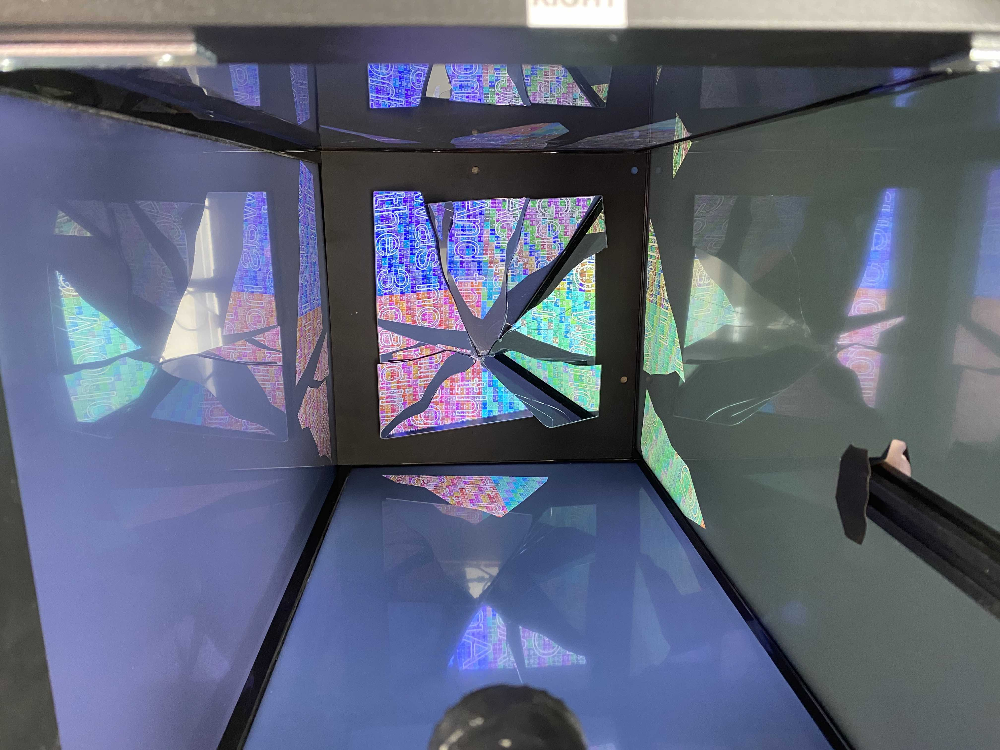

# Mirror Shard Pixel Mapper (WebGL)

**Note: This project was developed with AI assistance.**

This repo is a web-based (JS/WebGL2) visualization of the calibration + shader warping pipeline used for **[Rafael Lozano-Hemmer — *Broken Mirror Poets*](https://www.lozano-hemmer.com/broken_mirror_poets.php)**.

The core idea is to **pre-warp** a 4K source image so that, when viewed indirectly through **broken mirror shards**, the reflected fragments reassemble into a coherent image from a specific viewpoint.

## Live Demo

**[View Live Demo on GitHub Pages](https://stephanschulz.ca/light-network/)**

## Screenshots

### The 3D Box Visualization


### Source (top) + masked/transformed output (bottom)


## What this visualization represents

- **Physical installation model**:
  - A **4-wall "box"** made from **four displays/monitor quadrants** (arranged as walls).
  - A **camera** looks at the broken mirrors and the monitors' reflections.
  - Each mirror shard has a **mask polygon** (its outline in the camera/mirror view) and a **homography calibration** (point correspondences).
- **What we compute**:
  - A per-shard homography from **display/content space** ↔ **camera/mirror space**.
  - A shader that maps from the output pixel position back into the correct source texture location.
- **What we render**:
  - The output is rendered into **masked regions** (one per shard) using the stencil buffer.
  - Each shard shows a different warped part of the same 4K source image.

## Two Viewing Modes

### 1. 2D Shader View (`index.html`)

The primary shader output showing the warped 4K image with all shards masked and transformed. This is what would be displayed on the physical monitors.

**Features:**
- Source image selection from dropdown
- Debug view toggle (shows colored shard regions)
- Show all shards or individual shard selection
- Background color and alpha controls
- Pan and zoom controls for source image

### 2. 3D Box View (`box3d.html`)

A Three.js-based 3D visualization showing the physical installation layout with four portrait walls and a floor reconstruction.

**Features:**

#### Walls
- **4 portrait walls** (9 wide × 16 tall) showing quadrants of the 4K source
- Each wall displays one quadrant rotated 90° CCW to portrait orientation
- Front and back walls are horizontally flipped to match physical mirror reflections
- Configurable quadrant-to-wall mapping
- Toggle wall visibility and wall border outlines
- Show shard segment outlines on walls

#### Floor
- **Square floor** showing camera view reconstruction
- Uses homography matrices to map floor coordinates to source image
- Each shard is rendered with its calibrated homography transform
- The floor shows what the camera would see when looking at the mirror shards
- Toggle floor visibility and shard segment outlines

#### Source Image Controls
- **Scale slider** (0.1 - 3.0): Zoom in/out on the source image from center
- **Offset X/Y sliders**: Pan the source image content
- **Load custom 4K image**: Load any image via file picker

The scale and offset controls modify the source image BEFORE it goes through the shader pipeline, ensuring coherent reconstruction. This is equivalent to loading pre-scaled images like A-1.png, A-2.png, A-3.png with different sized content.

#### Camera & Animation
- **Orbit controls**: Click and drag to orbit around the box
- **Camera sway**: Subtle automatic rotation animation (toggleable)
- **Sway amount slider**: Control animation intensity

#### Display Options
- **Show/hide grid**: Reference grid on the floor
- **Line width**: Adjust outline thickness
- **Debug colors**: Show colored regions per shard
- **Background gray**: Adjust scene background brightness


### Physical Installation

The box3d.html visualization models this physical setup - four display walls surrounding broken mirror shards that reflect and combine the warped image fragments.



## Finished artwork photos

From `artwork/`:


## Running

Because the app loads shard data via `fetch()`, you must serve it via a local web server (opening the file directly will hit CORS restrictions).

Example:

```bash
cd /Applications/of_v0.12-2.0_osx_release/apps/brokenMirror/shader_pixelMapper-web
python3 -m http.server 8000
```

Then open:
- `http://localhost:8000/index.html` - 2D shader view
- `http://localhost:8000/box3d.html` - 3D box visualization

## Architecture

### Data Flow

```
Source Image (4K)
       ↓
[Scale/Offset Transform] ← GUI controls
       ↓
Shader Pipeline (app.js + shader.js)
  - Per-shard homography
  - Stencil masking
       ↓
Output Canvas (3840×2160)
       ↓
box3d.html captures and displays:
  - Walls: Quadrant extraction + rotation
  - Floor: Homography-based reconstruction
```

### Key Insight

The scale/offset controls work by modifying the source image at the shader input stage (in `app.js`), not by post-processing the output. This ensures that:
1. The homography transforms operate on the scaled/offset content
2. All shards sample coherently from the transformed source
3. The floor reconstruction remains aligned

This is why loading images with different sized content (A-1.png, A-2.png, A-3.png) produces coherent results - the shader processes whatever content is in the source, and the scale/offset sliders achieve the same effect dynamically.

## Repo layout

- **`index.html`**: 2D shader view UI + script includes
- **`box3d.html`**: 3D box visualization (Three.js)
- **`style.css`**: Styles for index.html
- **`shader.js`**: GLSL vertex/fragment shaders with homography transforms
- **`app.js`**: WebGL setup, shard loading, homography computation, stencil masking, render loop
- **`data/shardData.js`**: Shard configuration data
- **`data/shards/`**: Per-shard calibration + mask files
  - **`shardN_points.txt`**: 4 calibration point pairs (source ↔ display)
  - **`shardN_mask.txt`**: Shard outline polygon vertices
- **`data/images/`**: Source images (3840×2160)
  - Various test images including grid patterns and content

## Technical Details

### Homography Computation

Each shard has 4 point correspondences between:
- **Source points**: Where the content comes from in the 4K image
- **Display points**: Where it appears on the output display

A 3×3 homography matrix is computed using these correspondences, allowing any point in display space to be mapped back to source space for texture sampling.

### Stencil Masking

Each shard's mask polygon defines where it should be rendered. The stencil buffer ensures only pixels within the mask are drawn, preventing overlap between shards.

### Floor Reconstruction

The floor in box3d.html reconstructs the camera view by:
1. Creating a mesh for each shard's mask shape
2. Using a shader that applies the inverse homography
3. Sampling from the source texture at the computed coordinates

This recreates what the physical camera would see when looking at the mirror shard reflections.

## Dependencies

- **Three.js** (r128): 3D rendering for box3d.html
- **dat.GUI**: UI controls
- **WebGL2**: Required for shader functionality
